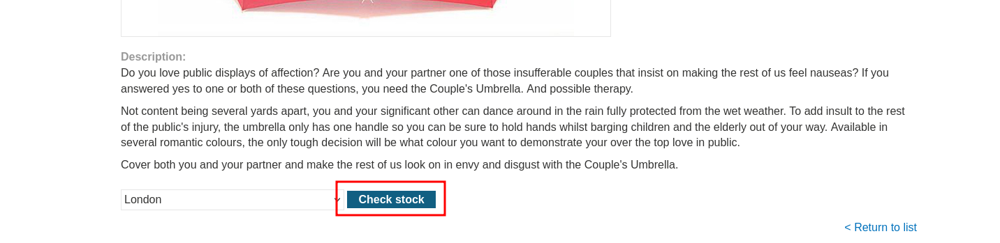
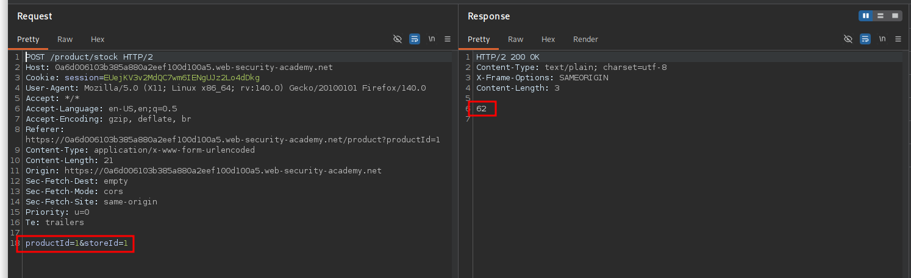
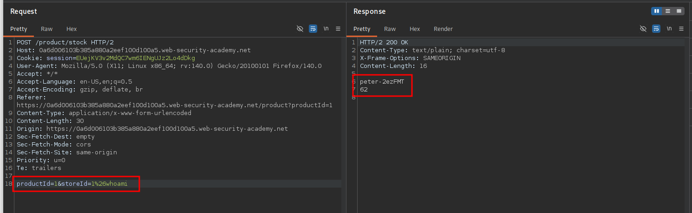
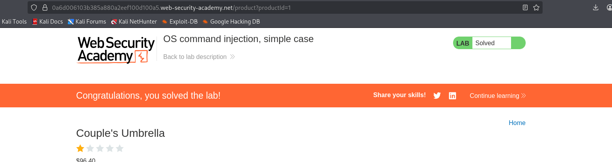

<p align="center">
  
</p>

<div align="center">

<table width="100%" border="1" cellpadding="6" cellspacing="0">
  <tr>
    <td align="left" ><b>🎯 Target</b></td>
    <td> OS command injection, simple case - <code> https://portswigger.net/web-security/os-command-injection/lab-simple </code></td>
  </tr>
  <tr>
    <td align="left" ><b>👨‍💻 Author</b></td>
    <td><code>sonyahack1</code></td>
  </tr>
  <tr>
    <td align="left" ><b>📅 Date</b></td>
    <td>23.05.2026</td>
  </tr>
  <tr>
    <td align="left" ><b>📊 Difficulty</b></td>
    <td>Easy 🟢</td>
  </tr>
  <tr>
    <td align="left" ><b>📁 Category</b></td>
    <td> Web </td>
  </tr>
  <tr>
    <td align="left" ><b>🛠️ Tools</b></td>
    <td> burp suite </td>
  </tr>
  <tr>
    <td align="left" ><b>💀 Objectives</b></td>
    <td>
	<code>name of the current user</code><br>
   </td>
  </tr>

</table>

</div>

<h2 align="center"> 📝 Report </h2>

> Open the lab and navigate to the homepage of the online store:

<p align="center">
 
</p>

> The lab description states that the `OS command injection` vulnerability is located in the `product stock checker` feature. Open any product page and scroll down to the `Check stock` function:

<p align="center">
 
</p>

> Intercept the request in `Burp Suite` and send it to `Repeater`:

<p align="center">
 
</p>

> Exploit the vulnerability using the following payload for the `storeId` parameter:

```bash

%26whoami

```

> As a result, we retrieve the username: `peter-2ezFMT`

<p align="center">
 
</p>


<p align="center">
 
</p>

> Lab is solved
